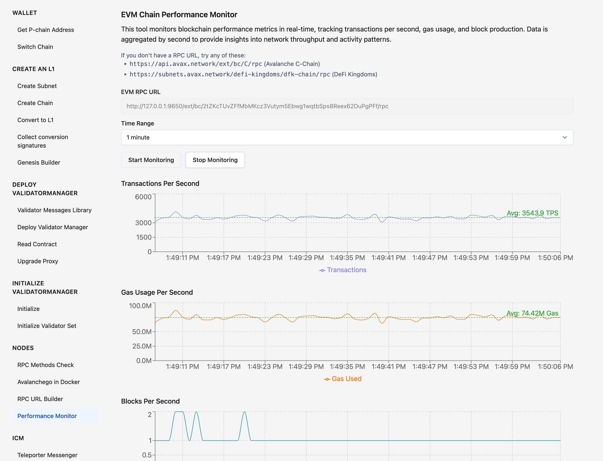

# evmbombard

A tool that bombards your EVM chain with a constant stream of transactions.

## Overview

Designed specifically for Avalanche L1s, but works with any EVM. Learn how to launch your own Avalanche
L1 at [build.avax.network](https://build.avax.network/).

### Installation

```bash
go install github.com/containerman17/experiments/2025-03/evmbombard
```

### Usage

```bash
evmbombard -rpc "http://127.0.0.1:9650/ext/bc/2tZKcT/rpc,http://node2:9650/ext/bc/2tZKcT/rpc" -batch 50 -keys 600
```

Replace RPC URLs with RPC urls of your Avalanche L1.

### How it Works

This tool bombards your EVM chain with a steady stream of transactions in
configurable batches. The process works as follows:

1. **Key Management**:
   - Generates a specified number of private keys (configurable via `-keys`
     flag)
   - Stores these keys in a local file (`.keys.txt`) for reuse between runs
   - Reads existing keys from the file when available

2. **Account Funding**:
   - Uses a pre-funded address (0x8db97C7cEcE249c2b98bDC0226Cc4C2A57BF52FC) as
     the source
   - Checks balances of generated accounts and funds only those that need it
   - Processes funding in efficient batches to maximize throughput
   - Waits for funding transactions to be confirmed before proceeding

3. **Transaction Bombardment**:
   - Each funded account continuously sends transactions to itself
   - Transactions are sent in parallel batches (configurable via `-batch` flag)
   - Manages nonces carefully to ensure transaction validity
   - Monitors for transaction confirmation and handles errors automatically
   - Spreads load across multiple RPC endpoints when available

4. **Performance Monitoring**:
   - Tracks transactions that have been mined
   - Reports errors and automatically retries when necessary
   - Monitors new blocks and transaction inclusion

The recommended batch size is below 79 transactions per batch. Try 2, 10, 15, 20 and 50. Beyond this threshold,
EVM nodes may start dropping transactions during network replication.

Performance improves significantly when using multiple RPC nodes. The example
below demonstrates what can be achieved with 5 nodes in the same datacenter,
allowing for thousands of transactions per second.

### Results example



3543 TPS sustained over 1 minute

### Launching Avalanche L1 for benchmarking

Below is a guide on how to launch your own Avalanche L1 for benchmarking:

1. Create 5 nodes on any cloud provider. I did it on AWS, 8 vCPU and 64GB RAM
   per node, but this is overkill. Single core performance matters more than
   number of cores.
2. [Create a subnet in the toolbox](https://build.avax.network/tools/l1-toolbox#createSubnet)
3. [Create a chain here](https://build.avax.network/tools/l1-toolbox#createChain)

Please use the following genesis data:

```
{
  "config": {
    "chainId": 99999,
    "feeConfig": {
      "gasLimit": 600000000,
      "minBaseFee": 1000000000,
      "targetGas": 400000000,
      "baseFeeChangeDenominator": 48,
      "minBlockGasCost": 0,
      "maxBlockGasCost": 10000000,
      "targetBlockRate": 1,
      "blockGasCostStep": 500000
    }
  },
  "alloc": {
    "8db97C7cEcE249c2b98bDC0226Cc4C2A57BF52FC": {
      "balance": "0xC097CE7BC90715B34B9F1000000000"
    },
    "0x0Fa8EA536Be85F32724D57A37758761B86416123": {
      "balance": "0xC097CE7BC90715B34B9F1000000000"
    }
  },
  "nonce": "0x0",
  "timestamp": "0x5FCB13D0",
  "extraData": "0x00",
  "gasLimit": "0x23C34600",
  "difficulty": "0x0",
  "mixHash": "0x0000000000000000000000000000000000000000000000000000000000000000",
  "coinbase": "0x0000000000000000000000000000000000000000",
  "number": "0x0",
  "gasUsed": "0x0",
  "parentHash": "0x0000000000000000000000000000000000000000000000000000000000000000"
}
```

4. Launch the validators on each machine. Please note in my example I use tag
   v0.7.2-fuji, please replace it
   [with the latest stable tag from dockerhub](https://hub.docker.com/r/avaplatform/subnet-evm/tags?name=v)

Replace REPLACE_THIS_WITH_YOUR_SUBNET_ID_FROM_STEP_1 with the subnet ID from
step 1.

Please note that this setup exposes your validator's port 9650 to the public
internet, which should be fine for benchmarking, but don't do this in
production.

```bash
docker run -it -d \
    --name rpc \
    -p 9650:9650 -p 9650:9650 \
    -v ~/.avalanchego_rpc:/root/.avalanchego \
    -e AVAGO_PARTIAL_SYNC_PRIMARY_NETWORK=true \
    -e AVAGO_PUBLIC_IP_RESOLUTION_SERVICE=opendns \
    -e AVAGO_PLUGIN_DIR=/avalanchego/build/plugins/ \
    -e AVAGO_HTTP_HOST=0.0.0.0 \
    -e AVAGO_TRACK_SUBNETS=REPLACE_THIS_WITH_YOUR_SUBNET_ID_FROM_STEP_1 \
    -e AVAGO_HTTP_PORT=8080 \
    -e AVAGO_STAKING_PORT=9653 \
    -e AVAGO_NETWORK_ID=fuji \
    -e AVAGO_HTTP_ALLOWED_HOSTS="*" \
    avaplatform/subnet-evm:v0.7.2-fuji
```

5. Collect proof of possession from every node using this command:

```bash
curl -X POST --data '{"jsonrpc":"2.0","id":1,"method":"info.getNodeID"}' -H "content-type:application/json;" 127.0.0.1:9650/ext/info
```

6. [Convert the subnet+chain to L1 here](https://build.avax.network/tools/l1-toolbox#convertToL1)
   You will need to provide proofs of possession from every node. Keep weights
   and balances the same. You will need 5 Fuji AVAX for that. Get it from the
   faucet
   [https://test.core.app/tools/testnet-faucet/](https://test.core.app/tools/testnet-faucet/)
   and transfer via the
   [cross chain transfer tool](https://test.core.app/stake/cross-chain-transfer/).

7. Open the subnet in the
   [EVM Performance Monitor tool](https://build.avax.network/tools/l1-toolbox#performanceMonitor).
   See screenshot above.

## Example output:

```
Using 5 RPC URLs
funding 2 accounts
2025/03/10 05:39:23 New block: 4836, tx count: 2
all accounts funded
2025/03/10 05:39:24 New block: 4837, tx count: 1
2025/03/10 05:39:25 New block: 4838, tx count: 49
2025/03/10 05:39:26 New block: 4839, tx count: 1250
2025/03/10 05:39:27 New block: 4840, tx count: 2153
2025/03/10 05:39:27 New block: 4841, tx count: 300
2025/03/10 05:39:28 New block: 4842, tx count: 2533
2025/03/10 05:39:29 New block: 4843, tx count: 3391
2025/03/10 05:39:30 New block: 4844, tx count: 3782
2025/03/10 05:39:31 New block: 4845, tx count: 4154
2025/03/10 05:39:32 New block: 4846, tx count: 3741
2025/03/10 05:39:33 New block: 4847, tx count: 3791
2025/03/10 05:39:34 New block: 4848, tx count: 4075
2025/03/10 05:39:34 New block: 4849, tx count: 555
2025/03/10 05:39:35 New block: 4850, tx count: 4804
2025/03/10 05:39:36 New block: 4851, tx count: 4674
2025/03/10 05:39:37 New block: 4852, tx count: 4533
2025/03/10 05:39:38 New block: 4853, tx count: 4135
2025/03/10 05:39:39 New block: 4854, tx count: 4939
2025/03/10 05:39:40 New block: 4855, tx count: 4606
Errors: 466, Last error: failed to send transaction: already known
2025/03/10 05:39:41 New block: 4856, tx count: 5080
2025/03/10 05:39:43 New block: 4857, tx count: 5118
2025/03/10 05:39:43 New block: 4858, tx count: 415
Errors: 100, Last error: failed to send transaction: already known
2025/03/10 05:39:43 New block: 4859, tx count: 5094
2025/03/10 05:39:44 New block: 4860, tx count: 3413
```
