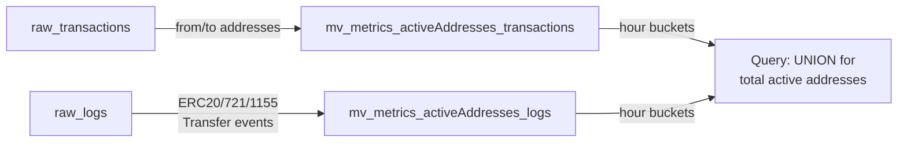
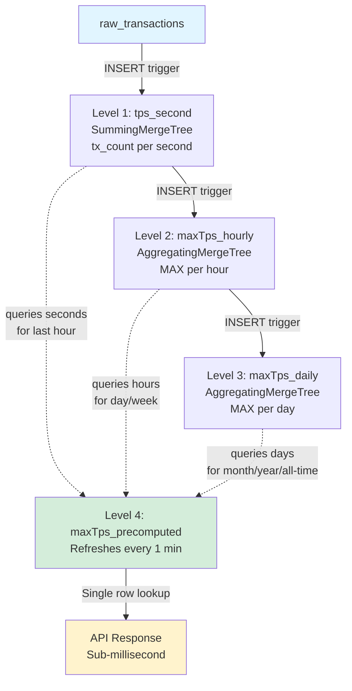

# Blockchain Data Pipeline

## Raw Data Storage

**Source:** [`pkg/chwrapper/raw_tables.sql`](pkg/chwrapper/raw_tables.sql)

We store blockchain data in ClickHouse across 5 tables:

### `raw_blocks`
Block headers with all the standard fields - number, hash, timestamp, gas metrics, state roots, etc. Partitioned by chain_id and month for efficient queries. Nothing fancy here, just denormalized block data.

### `raw_transactions`
Transaction data merged with receipt data in a single table. This is a key design decision - instead of separate transactions and receipts tables, we combine them for better query performance. Each row has:
- Transaction fields (from, to, value, input data)
- Receipt fields (gas_used, success status, contract_address if created)
- Denormalized block data (block_time, base_fee) to avoid joins

### `raw_traces`
Internal transaction calls (trace data). Uses an array to represent the call tree path - `[0,2,1]` means first top-level call → third subcall → second sub-subcall. Flattened structure, one row per trace.

### `raw_logs`
Smart contract event logs. Denormalizes some transaction data (tx_from, tx_to) to avoid joins when analyzing events. Topics are stored as separate columns (topic0-3) for efficient filtering.

### `sync_watermark`
Tiny RocksDB table tracking the last fully synced block per chain. This is the guarantee point - everything before this block is complete.

## Active Addresses Calculation

**Sources:**
- [`pkg/chwrapper/mvs/06_mv_metrics_activeAddresses_transactions.sql`](pkg/chwrapper/mvs/06_mv_metrics_activeAddresses_transactions.sql)
- [`pkg/chwrapper/mvs/07_mv_metrics_activeAddresses_logs.sql`](pkg/chwrapper/mvs/07_mv_metrics_activeAddresses_logs.sql)

We track active addresses from two sources, stored in separate materialized views that trigger on data insertion:

### From Transactions (`mv_metrics_activeAddresses_transactions`)
Captures addresses that directly sent or received ETH:
- `from` addresses (senders)
- `to` addresses (receivers, excluding contract creation)
- Aggregated by hour buckets
- Zero address excluded (it's not a real user)

### From Token Transfers (`mv_metrics_activeAddresses_logs`)
Captures addresses involved in token transfers by parsing event logs:
- ERC20/721 Transfer events (topic1 = from, topic2 = to)
- ERC1155 TransferSingle events (topic2 = from, topic3 = to)  
- ERC1155 TransferBatch events (same pattern)
- Addresses extracted from topics (bytes 13-32 of the 32-byte topic)
- Also aggregated by hour buckets

The principle: An address is "active" if it either sent/received ETH or tokens in that time period. We use two separate materialized views because ClickHouse only allows one source table per MV - you can't trigger a single MV from both `raw_transactions` and `raw_logs`. At query time, UNION both views to get total unique active addresses.

## Max TPS Pipeline

**Sources:**
- [`pkg/chwrapper/mvs/01_mv_rollingWindowMetrics_tps_second.sql`](pkg/chwrapper/mvs/01_mv_rollingWindowMetrics_tps_second.sql)
- [`pkg/chwrapper/mvs/02_mv_rollingWindowMetrics_maxTps_hourly.sql`](pkg/chwrapper/mvs/02_mv_rollingWindowMetrics_maxTps_hourly.sql)
- [`pkg/chwrapper/mvs/03_mv_rollingWindowMetrics_maxTps_daily.sql`](pkg/chwrapper/mvs/03_mv_rollingWindowMetrics_maxTps_daily.sql)
- [`pkg/chwrapper/mvs/04_mv_rollingWindowMetrics_maxTps_precomputed.sql`](pkg/chwrapper/mvs/04_mv_rollingWindowMetrics_maxTps_precomputed.sql)

This is a cascading aggregation pipeline - each level feeds the next, reducing data volume at each step:

### Level 1: Second-level TPS (`rollingWindowMetrics_tps_second`)
- Counts transactions per second from `raw_transactions`
- SummingMergeTree automatically sums duplicate entries
- Base data for all TPS calculations

### Level 2: Hourly Max TPS (`rollingWindowMetrics_maxTps_hourly`)  
- Takes max TPS from each hour using the seconds table
- Uses AggregatingMergeTree with `maxState` to store the aggregation state
- Triggers on inserts to the seconds **table** (not the materialized view)

### Level 3: Daily Max TPS (`rollingWindowMetrics_maxTps_daily`)
- Takes max TPS from each day using the hourly table  
- Same AggregatingMergeTree pattern, cascading from hourly data
- Enables efficient queries for longer time ranges

### Level 4: Pre-computed Values (`rollingWindowMetrics_maxTps_precomputed`)
- Refreshes every minute
- Pre-calculates all common time windows (last hour, day, week, month, 90 days, year, all-time)
- Uses the appropriate aggregation level for each window:
  - Last hour: queries seconds directly (max 3,600 rows)
  - Last day/week: queries hourly aggregates (max 24-168 rows)
  - Longer periods: queries daily aggregates (max 365 rows for a year)
- Single row lookup for instant results

### The Design Principle
Instead of scanning millions of transactions for "what's the max TPS this month?", we:
1. Aggregate once at insertion time (seconds)
2. Cascade aggregations to coarser granularities (hours, days)
3. Pre-compute all 7 time windows every minute in a single refreshable MV
4. API just does a single row lookup: `SELECT * FROM precomputed WHERE chain_id = ? ORDER BY computed_at DESC LIMIT 1`
5. For "total" across chains: `SELECT MAX(last_hour), MAX(last_day)... FROM (latest row per chain)`
6. Result: single row fetch = instant response regardless of data volume

The key insight: blockchain data is append-only. Historical maxTPS values never change, so aggressive pre-aggregation works perfectly. The only thing that changes is the current/recent data, which the refreshable view handles.
